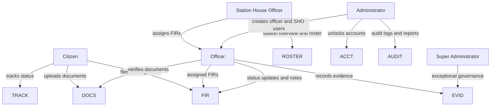
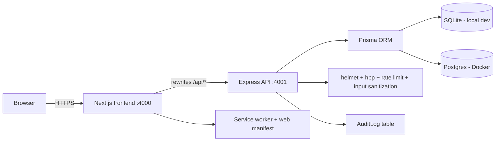
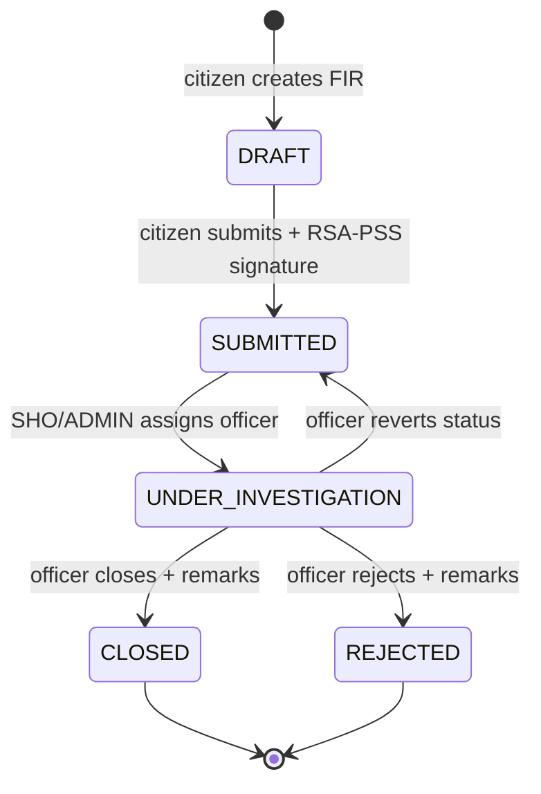
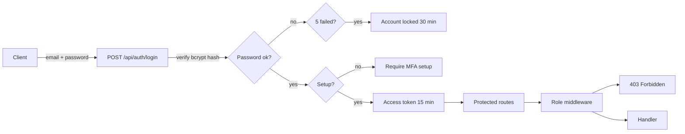
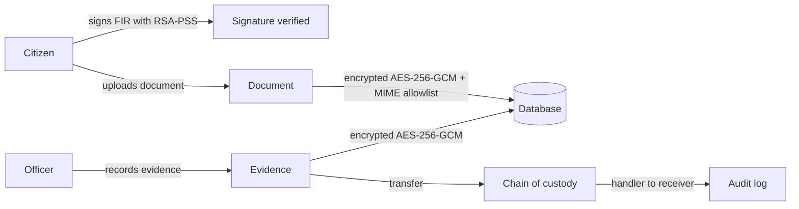

# OnlineFirPortal

An accessible 24/7 First Information Report (FIR) filing platform where
citizens gain a trackable reporting path and police workflows keep evidence
integrity, privacy, auditability, and controlled access.

OnlineFirPortal is **research and demonstration software**. It is a full-stack
reference implementation of a civic FIR system, not deployed public
infrastructure and not affiliated with or operated by any government. See
[Limitations](#limitations-and-non-goals) and
[SECURITY.md](SECURITY.md) for the honest scope.

---

## The problem

Citizens who need to report an incident today depend on visiting a police
station during working hours, which is a real barrier for mobility-limited
people, shift workers, and rural residents. Law enforcement, in turn, has a
legitimate need for integrity: an FIR record must be attributable, tamper
evident, accessible only to the people who need it, and surrounded by an
audit trail so that every change is accountable.

This project demonstrates a complete implementation of both sides of that
problem:

- a filing path a citizen can use at any time, with drafts, digital
  signatures, document upload, and status tracking;
- police workflows that preserve evidence integrity (encryption plus a chain
  of custody), limit access by role, and log every protected action.

## What it is, and what it is not

Verified scope of this codebase:

- JWT access and refresh authentication with TOTP multi-factor enrollment
  (speakeasy) and 10 recovery codes.
- Account lockout after 5 failed logins for 30 minutes, password strength
  rules (minimum 12 characters, upper, lower, digit, special), and password
  history checks that block recent reuse.
- Role-based access control over 5 roles: `CITIZEN`, `OFFICER`, `SHO`,
  `ADMIN`, `SUPER_ADMIN`, enforced through middleware on every protected route.
- A full FIR lifecycle from draft through assignment, investigation notes,
  and closure, with every transition written to a timeline and the audit log.
- AES-256-GCM encryption of FIR payloads and uploaded documents; RSA-PSS
  digital signatures on FIR submission; bcrypt password hashing.
- Evidence records with a handler-to-receiver chain of custody.
- An administration panel for user creation, account unlock, password reset
  approval, audit log review and export, and reports.
- A public-key register that lets citizens bind an RSA key before signing.
- Reference modules for IPC section lookup, a criminal registry, a duty
  roster, and a security lab (Base64 and key exchange demos).

Explicit limitations:

- No production SMS or email adapters. The notification service ships with a
  mock provider that logs to the console; in-app notifications are persisted.
- Aadhaar verification is a local mock. A six-digit OTP is generated,
  printed to the server console, and checked in memory. There is no UIDAI or
  external identity integration.
- The local default database is SQLite. Docker Compose uses Postgres. The two
  paths are not continuously exercised against each other.
- No key rotation or secret-management integration.
- The codebase has not been independently security audited.

## Roles and responsibilities

| Role | Responsibilities |
| --- | --- |
| `CITIZEN` | Register, verify Aadhaar (mock), enroll MFA, register an RSA public key, file, sign and submit FIRs, upload documents, track own FIRs, receive notifications. |
| `OFFICER` | Work the FIRs assigned to them: update status, add investigation notes, verify documents, record evidence and transfers, search criminals, look up IPC sections. |
| `SHO` | Station-level oversight: assign FIRs to officers, manage the duty roster, view station workload. Inherits officer capabilities within the station. |
| `ADMIN` | Create officer, SHO and admin accounts, unlock locked accounts, approve password resets, review and export audit logs, view reports and manage system settings. |
| `SUPER_ADMIN` | Highest privilege for exceptional evidence governance and administrative edge cases. |



The role model is defined in
`OnlineFirPortal.backend/prisma/schema.prisma` (`UserRole` enum) and enforced
in `src/lib/access-control.ts` and `src/lib/auth-middleware.ts`.

## System architecture

A Next.js frontend proxies `/api/*` to an Express API. The API talks to the
database through Prisma, applies a global security middleware stack, and
writes audit events on protected actions. All secrets, encryption keys, and
the JWT signing keys live in backend environment variables and are never
bundled to the browser.



## FIR submission and investigation lifecycle

A citizen creates a draft, optionally signs it with an RSA-PSS signature, and
submits. An SHO or administrator assigns the FIR to an officer, which moves it
to `UNDER_INVESTIGATION`. Officers update status and add investigation notes
until the case is closed or rejected; closing and rejecting both require a
written reason. Every transition writes a timeline entry and an audit record.

The `FIRStatus` enum declares ten states. Current routes actively set a subset
of them: `DRAFT`, `SUBMITTED`, `UNDER_INVESTIGATION`, `CLOSED` and `REJECTED`.
The remaining values (`VERIFIED`, `ASSIGNED`, `INVESTIGATION`, `CHARGESHEET`,
`ARCHIVED`) are defined in the schema for lifecycle breadth and are not yet
assigned by a route.



The lifecycle is implemented in `src/routes/firs.ts`. The encrypted payload,
signature verification, and timeline are handled there.

## Authentication and authorization boundaries

Authentication uses a short-lived JWT access token (15 minutes) and a
long-lived refresh token (7 days), issued with separate signing secrets.
MFA enrollment generates a TOTP secret and QR code for authenticator apps, and
verification tolerates a 30-second time drift window. Failed logins are
counted per account; after five failures the account is locked for 30 minutes.
Authentication endpoints sit behind a stricter rate limit than the rest of the
API.



Authorization is enforced twice: a role gate on each route, and an
object-level check that a citizen can only read or modify their own FIRs.
The policy matrix lives in `src/lib/access-control.ts`; the middleware lives
in `src/lib/auth-middleware.ts`.

## Evidence upload and cryptographic integrity

Sensitive data is protected both in transit and at rest. FIR payload fields
and uploaded document contents are encrypted with AES-256-GCM before they are
stored, so the database never holds plaintext incident details. Citizens can
register an RSA public key and sign FIR submissions; the server verifies the
signature with RSA-PSS before accepting the record as submitted. Passwords are
hashed with bcrypt. Uploaded files are limited to 10 MB and an allow-list of
MIME types.



Evidence carries a `ChainOfCustody` history recording every handler and
receiver, so the audit trail follows the object as well as the actor.
Cryptographic helpers are in `src/lib/security.ts`.

## Audit trail and accountability

Every protected action is recorded in the `AuditLog` table through
`src/lib/audit-logger.ts`: who (user id, role, name), what (`AuditAction`),
which resource, when, from where (IP and user agent), whether it succeeded,
and a JSON diff of what changed. Administrators can query and export the trail.
Login successes and failures are audited alongside FIR, document, evidence,
and user-management actions.

Representative `AuditAction` values: `LOGIN_SUCCESS`, `LOGIN_FAILED`,
`FIR_CREATED`, `FIR_SUBMITTED`, `FIR_STATUS_UPDATED`, `FIR_ASSIGNED`,
`DOCUMENT_UPLOADED`, `DOCUMENT_VERIFIED`, `DELETE_DOCUMENT`,
`CRIMINAL_LINKED`, `REGISTER`, `VIEW_AUDIT_LOG`, `ACCOUNT_UNLOCKED`.

## Threat model

| Asset | Representative threat | Control |
| --- | --- | --- |
| User credentials | Password guessing / credential stuffing | bcrypt hashing, 5-attempt lockout, auth rate limit |
| Session tokens | Token theft or forgery | Separate signing secrets, 15 min access / 7 day refresh, hashed session records |
| FIR payloads | Database read of sensitive incident details | AES-256-GCM encryption at rest |
| Uploaded documents | Unauthorized download or tampering | Encryption, MIME allow-list, size cap, role + ownership checks |
| FIR integrity | Submitted record altered after the fact | RSA-PSS signature verification, timeline, audit log |
| Evidence chain | Unauthorized custody transfer | Role-gated evidence actions, chain of custody records |
| Administrative abuse | Privilege escalation or silent changes | Role middleware, object-level checks, audit on every action |

The full asset and control inventory, including configuration defaults, is in
[docs/security.md](docs/security.md).

## API overview

All routes are mounted under `/api`. Every route except registration, login,
Aadhaar OTP, IPC lookup, and the public landing requires a bearer token.

| Group | Routes | Roles |
| --- | --- | --- |
| `/api/auth` | register, login, refresh, logout, MFA setup/verify, recovery codes, password reset/change, public key register, Aadhaar request/verify | public + authenticated |
| `/api/firs` | create, submit, list, get, stats, officers, assign, update-status, notes | citizen + officer workflow |
| `/api/documents` | list, upload, download, verify, delete | citizen + officer workflow |
| `/api/evidence` | create, get, transfer, chain of custody | OFFICER, SHO, ADMIN |
| `/api/admin` | create officer/SHO/admin, list users, unlock, reset approvals, audit logs, reports, settings | ADMIN, SUPER_ADMIN |
| `/api/criminals` | search, create, link to FIR | OFFICER, SHO, ADMIN |
| `/api/roster` | current roster, assign shift, update status | SHO, ADMIN (and officers for their shift) |
| `/api/ipc` | search sections, chapters, section detail | public |
| `/api/notifications` | list, mark all read | authenticated |
| `/api/security-lab` | Base64 demo, key exchange demo | authenticated |

Detailed request and response shapes are derived from the route modules in
[docs/api.md](docs/api.md).

## Tech stack

| Layer | Technology |
| --- | --- |
| Runtime | Node.js 20 (backend), Node.js (frontend build) |
| Backend framework | Express 5 with TypeScript |
| ORM / database | Prisma, SQLite locally, Postgres in Docker |
| Authentication | JSON Web Tokens, speakeasy TOTP, bcrypt |
| Cryptography | AES-256-GCM, RSA-PSS, SHA-256 (Node `crypto` / WebCrypto) |
| Frontend | Next.js 16, React 19, Tailwind CSS 4, Radix UI |
| Frontend state / forms | react-hook-form, zod, tanstack-free local stores |
| Charts | Recharts |
| Tests | Jest and Bun (backend), Vitest and Playwright (frontend) |
| Ops | Docker Compose, nginx, `backup.sh` and `monitor.sh` scripts |

## Repository structure

```
.
├── OnlineFirPortal.backend/        # Express + Prisma API
│   ├── prisma/                     # schema, migrations, seed
│   ├── src/
│   │   ├── lib/                    # security, auth, access control, audit
│   │   └── routes/                 # one module per resource
│   └── tests/                      # Jest unit/integration, Bun e2e
├── OnlineFirPortal.frontend/       # Next.js application
│   ├── app/                        # App Router pages
│   ├── components/                 # UI components
│   └── tests/                      # Vitest unit/component, Playwright e2e
├── docs/                           # architecture, security, testing, API, deployment
├── docker-compose.yml              # backend + frontend + postgres + nginx
└── .github/                        # issue templates, PR template, CI workflows
```

[docs/architecture.md](docs/architecture.md) maps every `src/lib/*` and
`src/routes/*` module to its responsibility.

## Quick start

Requirements: Node.js 20 or newer, npm, and optionally Bun for the backend
end-to-end suite.

Backend (API on port 4001):

```bash
cd OnlineFirPortal.backend
npm ci
cp .env.example .env        # then fill in unique secret values
npx prisma generate
npm run dev
```

Frontend (app on port 4000, in a second terminal):

```bash
cd OnlineFirPortal.frontend
npm ci
cp .env.example .env.local  # set API_BASE_URL=http://localhost:4001
npm run dev
```

Open http://localhost:4000. The backend responds on
http://localhost:4001. The `.env.example` files document every variable;
real secrets must never be committed.

## Tests

Backend:

```bash
cd OnlineFirPortal.backend
npm run test:jest    # Jest unit + integration suites
npm run test:bun     # Bun end-to-end suite
```

Frontend:

```bash
cd OnlineFirPortal.frontend
npm test             # Vitest unit + component suites
npx playwright test  # Playwright end-to-end (needs the app running)
```

Verified suites:

| Suite | Files | What it covers |
| --- | --- | --- |
| Jest unit | `access-control`, `password-service`, `security`, `security-lab`, `totp-service` | RBAC matrix, password rules and history, encryption helpers, lab helpers, TOTP verification |
| Jest integration | `auth`, `firs` | Registration, login, lockout, FIR create/submit flows against the real router |
| Bun e2e | `auth`, `fir`, `stats` | Full request lifecycle against a running app |
| Vitest unit | `auth-store`, `digital-signature` | Frontend auth state, signature encoding helpers |
| Vitest component | `Sidebar` | Navigation component rendering |
| Playwright e2e | `fir-portal` | Browser journeys across Chromium, Firefox, and WebKit |

Run the linter and type checks before opening a pull request:

```bash
cd OnlineFirPortal.backend && npx tsc --noEmit
cd OnlineFirPortal.frontend && npm run lint && npx tsc --noEmit
```

[docs/testing.md](docs/testing.md) explains each suite and its thresholds.

## Docker deployment

```bash
docker compose up --build
```

The Compose file runs the backend, the frontend, Postgres, and nginx. nginx
terminates TLS, so `cert.pem` and `key.pem` must be provided before a public
deployment. Operational scripts and the reverse proxy config are documented
in [docs/deployment.md](docs/deployment.md).

## Screenshots

Real captures from the running application are added to
[docs/screenshots/](docs/screenshots/) as part of the local run-through. They
show the landing page, the FIR filing form, tracking, the citizen dashboard,
the officer dashboard, and the administration panel. No fabricated images are
used anywhere in this repository.

## Limitations and non-goals

- **Research and demonstration software.** Not deployed public infrastructure,
  not independently audited, and not affiliated with any government.
- **No production notification adapters.** SMS and email use a mock provider.
- **No external identity integration.** Aadhaar OTP is simulated in memory.
- **Database drift.** Local SQLite and Docker Postgres are not continuously
  cross-tested.
- **No key rotation.** JWT, encryption, and FIR encryption keys are static
  per deployment.
- **Non-goals by design:** this project does not attempt offline field
  reporting, language localization, or integration with any law enforcement
  system of record.

## Roadmap

Genuine technical gaps, in rough priority order:

1. Secret management (Vault or similar) and key rotation for JWT and
   encryption keys.
2. Real SMS/email adapters behind the existing provider interface.
3. Postgres and SQLite parity in the test matrix.
4. An external identity-verification integration with documented privacy boundaries.
5. Broader Playwright coverage of the officer and admin journeys.
6. A formal security review pass.

## Contributing, license, and security

- Contributions: [CONTRIBUTING.md](CONTRIBUTING.md)
- License: [MIT](LICENSE), copyright (c) 2026 Anurup R Krishnan
- Security: [SECURITY.md](SECURITY.md) describes the threat model and the
  private disclosure flow for reporting a vulnerability.
