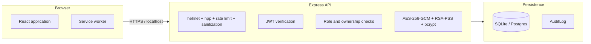

# Security

OnlineFirPortal is research and demonstration software. This document is the
threat model for the code as it exists. It is not a claim of certification;
the codebase has not been independently audited.

## Trust boundaries

The browser only ever receives JWT identity claims and encrypted blob
references; secrets, encryption keys, and signing keys exist only in the
backend environment.

## Cryptographic primitives

- **AES-256-GCM** encrypts FIR payloads (`encryptData`/`decryptData`) and
  uploaded document content before storage, using `ENCRYPTION_KEY`. GCM
  provides authenticated encryption: modified ciphertext fails the auth tag
  and raises an error instead of yielding corrupt plaintext.
- **RSA-PSS** verifies citizen digital signatures on FIR submission against a
  registered public key. The server reconstructs the plaintext payload,
  verifies the signature, and only then accepts the FIR as signed.
- **bcrypt** hashes passwords (`bcryptjs`), with per-user salt.
- **SHA-256** hashes opaque session tokens at rest in the `Session` table.
- **speakeasy TOTP** generates and verifies six-digit codes with a one-step
  (30 second) drift window. Setup produces an `otpauth://` URI and a QR code.

## Authentication flow

1. Registration validates Aadhaar format (mock OTP), email, mobile, and
   password strength (minimum 12 characters, upper, lower, digit, special).
2. Login verifies the bcrypt hash, enforces lockout, records failures, and
   returns a temporary token plus an MFA challenge when MFA is enrolled.
3. MFA verification exchanges a valid TOTP code for a 15-minute access token
   and a 7-day refresh token, signed with different secrets.
4. Refresh tokens rotate at the refresh endpoint. Logout revokes the session.

## Account lockout and rate limiting

- **Login lockout:** 5 failed attempts within 30 minutes lock the account for
  30 minutes (`MAX_LOGIN_ATTEMPTS` and `ACCOUNT_LOCKOUT_DURATION` in
  `src/lib/security.ts`). Administrators can unlock an account from the admin
  panel.
- **API rate limit:** 500 requests per 15 minutes per IP
  (`API_RATE_LIMIT_WINDOW_MS`, `API_RATE_LIMIT_MAX`).
- **Auth rate limit:** 300 requests per hour per IP on `/api/auth`
  (`AUTH_RATE_LIMIT_WINDOW_MS`, `AUTH_RATE_LIMIT_MAX`).
- **Security lab rate limit:** 300 requests per 15 minutes
  (`CUSTOM_RATE_LIMIT_WINDOW_MS`, `CUSTOM_RATE_LIMIT_MAX`).

All rate limits are configurable in the backend environment.

## Authorization model

`src/lib/access-control.ts` defines the role/resource/action matrix. Middleware
in `src/lib/auth-middleware.ts` enforces it on routes, and handlers enforce
object-level rules: a citizen can only read or modify their own FIRs, an
officer only sees the FIRs assigned to them, and station data is scoped by
`policeStation`.

## Audit logging

`src/lib/audit-logger.ts` writes one row per protected action with the actor,
role, action, resource, IP, user agent, success flag, and a JSON diff. The
admin panel exposes filtered review and JSON export. Login success and failure
are audited to support detection of credential-stuffing or lockout abuse.

## Asset and control inventory

| Asset | Threat | Control |
| --- | --- | --- |
| Passwords | Offline cracking | bcrypt with salt; strength rules; history check |
| Accounts | Brute force | 5-attempt lockout for 30 minutes; auth rate limit |
| Access tokens | Forgery | HS256 with a unique `JWT_SECRET`, issuer and audience claims |
| Refresh tokens | Reuse | Separate `JWT_REFRESH_SECRET`; rotation on refresh |
| FIR payloads | DB compromise reads | AES-256-GCM at rest |
| Documents | Tampering or theft | AES-256-GCM; MIME allow-list; 10 MB cap; ownership checks |
| FIR integrity | Altered records | RSA-PSS verification; immutable timeline; audit rows |
| Evidence | Unauthorized transfer | Role-gated endpoints; chain of custody history |
| API | Flooding | express-rate-limit layers |
| Inputs | XSS / parameter pollution | recursive sanitization, `hpp`, helmet headers, zod validation |
| Admin actions | Silent abuse | ADMIN/SUPER_ADMIN gates; audit on every mutation |

## Operational configuration

Secrets are read from the environment and never shipped to the browser:
`JWT_SECRET`, `JWT_REFRESH_SECRET`, `ENCRYPTION_KEY`, `FIR_ENCRYPTION_KEY`.
`dotenv-safe` refuses to start when any required variable is missing or empty.
`CORS_ORIGIN` controls which browser origins may call the API.

## Remaining gaps

Tracked honestly in `docs/roadmap.md`:

- No key rotation or secret-management integration.
- No production SMS/email adapters (mock provider).
- Aadhaar verification is a local mock, not a UIDAI integration.
- SQLite and Postgres paths are not continuously cross-tested.
- No independent security audit has been performed.

Report suspected vulnerabilities through the private GitHub Security Advisory
flow described in `SECURITY.md`.
